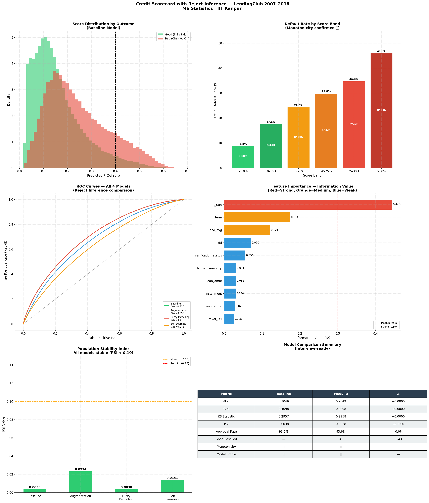

# Credit Scorecard with Reject Inference

A Basel II–style credit scorecard built on 1.3M+ LendingClub loans, extended with three reject inference methods to correct for the sample selection bias that comes from training only on applicants a lender already chose to fund.

**Sohom Halder** · MSc Statistics, IIT Kanpur
`Python` · `pandas` · `scikit-learn` · `matplotlib` · `seaborn` · `Streamlit`

---

## Overview

Every scorecard trained the conventional way — on accepted applicants only — inherits the bias of whatever underwriting rule generated that population. It has never seen the applicants who got turned away, which is exactly the population it needs to evaluate once deployed. This project builds a baseline scorecard the standard way (Weight of Evidence encoding → logistic regression → FICO-style point scaling), then implements and honestly compares **three reject inference techniques** — Augmentation, Fuzzy Parcelling, and Self-Learning — to see whether folding in LendingClub's ~27.6M rejected applications actually improves on it.

The full pipeline — EDA, feature engineering, modelling, reject inference, population stability monitoring, business impact translation, and a Streamlit deployment app — is in [`credit_default_final.ipynb`](./credit_default_final.ipynb).

## Results at a Glance

Evaluated on a held-out, time-based out-of-sample test set (loans issued in 2016; the model never sees 2016 during training):

| Model | AUC | Gini | KS | PSI (train vs. test) |
|---|---|---|---|---|
| Baseline (accepted only) | 0.7049 | 0.4098 | 0.2957 | 0.0038 — Stable |
| Method 1: Augmentation | 0.6748 | 0.3497 | 0.2537 | 0.0234 — Stable |
| **Method 2: Fuzzy Parcelling** | **0.7049** | **0.4098** | **0.2958** | 0.0038 — Stable |
| Method 3: Self-Learning | 0.6382 | 0.2765 | 0.1977 | 0.0141 — Stable |

**Fuzzy Parcelling** is the strongest of the three: it matches baseline discrimination almost exactly while training on the full through-the-door population, which makes it the most theoretically defensible choice. Augmentation and Self-Learning both underperform the baseline — reject inference doesn't automatically help, and this project reports that plainly rather than only showing the flattering result.

The uplift ceiling for all three methods is set by data, not method: only **3 of the 10 modelling features** (`fico_avg`, `dti`, `loan_amnt`) exist in the rejected-loan file, versus a full application record for accepted loans — consistent with the classic finding in Hand & Henley (1993) that reject inference is fundamentally limited by what you actually know about the people you rejected.

## Methodology

| Phase | What happens |
|---|---|
| 1 — Data Foundation & EDA | Build the modelling population (1,345,310 loans reaching a final status: 80.0% Fully Paid, 20.0% Charged Off); benchmark against LendingClub's own grade; check missingness and class balance |
| 2 — Feature Engineering (WoE / IV) | Restrict to 20 application-time-only variables (drop anything that only exists because a loan already defaulted); engineer, cap outliers at the 1st/99th percentile, and rank by Information Value; 10 features clear the IV ≥ 0.02 threshold and go into modelling |
| 3 — Baseline Scorecard | Time-based split (train 2007–2015, test 2016, 2017–2018 excluded as immature); L2-regularised logistic regression on WoE features; scaled to a 300–850 FICO-style score |
| 4 — Reject Inference | Three independent methods scored against the same baseline and same test set: Augmentation (soft-labelled rejects, 1:1 sampled), Fuzzy Parcelling (each reject contributes a weighted good row and a weighted bad row), Self-Learning (5-round semi-supervised loop, adaptive confidence thresholds) |
| 5 — Model Comparison & PSI | All four models scored side by side; Population Stability Index checks whether the scored population has drifted between train and test |
| 6 — Business Impact | Translates discrimination metrics into approval rates, wrongly-rejected good customers, and an illustrative revenue/loss estimate at a 400,000-loan annual volume |
| 7 — Visualisation Dashboard | Six-panel summary exhibit combining every result above into one image |
| 8 — Deployment | A 3-page Streamlit app (KPI overview, single-applicant scoring form, model performance dashboard) that reapplies the identical WoE lookup used in training |

## Dataset

[LendingClub Loan Data, 2007–2018Q4](https://www.kaggle.com/datasets/wordsforthewise/lending-club) (Kaggle, CC0 Public Domain) — accepted and rejected loan applications, sourced directly from LendingClub.

The raw files (`accepted_2007_to_2018Q4.csv`, `rejected_2007_to_2018Q4.csv`) are **not included in this repository** — combined they run to several GB. Download them from the link above and place both CSVs in the project root before running the notebook.

## Repository Structure

```
credit-scorecard-reject-inference/
├── README.md
├── credit_default_final.ipynb   # full pipeline, phases 1–8
├── app.py                       # generated by the notebook's final cell
├── requirements.txt
├── images/                      # exported from the notebook's plt.savefig() calls
│   ├── eda_grade_vintage.png
│   ├── eda_purpose_state_emp.png
│   ├── eda_missing_heatmap.png
│   ├── eda_class_distributions.png
│   ├── baseline_roc_ks.png
│   ├── baseline_score_distribution.png
│   ├── model_comparison.png
│   ├── psi_analysis.png
│   └── dashboard.png
└── saved_objects/               # model + WoE artifacts written by the notebook
```

`saved_objects/` and any raw data folder should be listed in `.gitignore` if the `.csv`/`.pkl` files inside them are large — GitHub is not the place for multi-hundred-MB data files.

## Tech Stack

Confirmed from the notebook's own environment check:

```
pandas       3.0.3
numpy        2.4.6
seaborn      0.13.2
matplotlib   3.10.9
```

Also used, exact pinned versions not captured by the notebook — run `pip freeze` in your own environment and update `requirements.txt` accordingly:

```
scikit-learn
scipy
streamlit
joblib
```

## Getting Started

```bash
# 1. Clone and enter the repo
git clone https://github.com/<sohom21-bit>/credit-scorecard-reject-inference.git
cd credit-scorecard-reject-inference

# 2. Install dependencies
pip install -r requirements.txt

# 3. Download accepted_2007_to_2018Q4.csv and rejected_2007_to_2018Q4.csv
#    from the Kaggle link above and place both in this directory

# 4. Run the notebook top to bottom
jupyter notebook credit_default_final.ipynb

# 5. Launch the scoring app (after the notebook has run at least once,
#    so saved_objects/ and app.py exist)
streamlit run app.py
```

## Key Findings
- **Reject inference isn't automatically an improvement.** Of three methods tested, only Fuzzy Parcelling matches baseline performance; Augmentation and Self-Learning both score lower on AUC, Gini, and KS. The result is reported as-is rather than only presenting the method that worked.
- **The ceiling on uplift is a data problem, not a modelling problem.** Only 3 of the 10 selected features are available in the rejected-loan file, which caps how much any reject inference method can realistically correct for selection bias — a limitation flagged going in, not discovered after the fact.
- **All four models are stable over time.** Every PSI value falls well inside the conventional < 0.10 "stable" band (range: 0.0038–0.0234), meaning none of the scored populations have drifted materially between the 2007–2015 training window and the 2016 test window.
- **Default rate rises monotonically with predicted score**, and the WoE transformation retains the full 1,345,310-row population with zero rows dropped to nulls — a deliberate `np.digitize`-based bin lookup replaces the more fragile pandas-`Interval` matching used in an earlier version of this pipeline.
- **The Streamlit app scores identically to the notebook.** The single-applicant form reapplies the exact same WoE bin edges and lookup logic used in training, including a specific fix ensuring the `term` feature is matched as a string in the same format (`"36.0"` / `"60.0"`) the WoE table was built with.


## Limitations

- Reject inference results depend on the baseline model's own risk ranking to score the rejected pool in the first place — a well-known circularity in this approach (Hand & Henley, 1993) that no amount of method choice fully escapes.
- The business impact figures use illustrative unit economics (flat average loan size, rate, term, and loss-given-default) rather than segment-level assumptions, so they should be read as directional, not as a production revenue forecast.
- FICO score, employment length, and several other fields are self-reported or lender-verified at different tiers; no additional external verification was applied beyond what's already present in the LendingClub data.

## References

- Siddiqi, N. (2006). *Credit Risk Scorecards: Developing and Implementing Intelligent Credit Scoring.* Wiley.
- Hand, D. J., & Henley, W. E. (1993). Can reject inference ever work? *IMA Journal of Mathematics Applied in Business and Industry*, 5(1), 45–55.

## Author

**Sohom Halder**
MSc Statistics, IIT Kanpur
[LinkedIn] · [GitHub] · [Email]

